# Layout Design of Transmission Gate based 2:1 Analog Multiplexer to Illustrate ASK and BPSK modulation techniques  

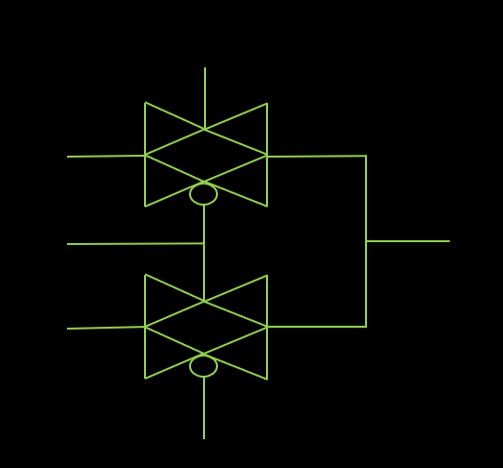
---  
# Introduction 
This project focuses on the design, simulation, and layout implementation of a transmission-gate-based analog multiplexer (MUX) using Xschem and Magic VLSI tool with SCMOS technology. Analog multiplexers are fundamental building blocks in communication and signal-processing systems, enabling the selection of one signal from multiple inputs for further processing.

The designed MUX is applied to demonstrate Amplitude Shift Keying (ASK) and Binary Phase Shift Keying (BPSK) modulation techniques, showing its practical relevance in digital communication. The project highlights the VLSI workflow from schematic design and simulation in Xschem, followed by layout implementation in Magic.

This work serves as a reference for students and engineers aiming to understand the integration of analog circuit design, layout, and modulation applications in a practical VLSI environment.  

--- 
# Tools Used  
- Xschem: Used for schematic design and circuit-level simulation of the transmission-gate analog multiplexer.

- Magic VLSI Tool: For layout implementation of the MUX in SCMOS technology.

- Ngspice: Used for SPICE-level simulation of both schematic and layout designs to validate functionality. All simulations were performed using Level 1 SPICE models, providing basic transistor-level behaviour while keeping the simulation simple and efficient.

- Ubuntu OS: The entire design, simulation, and layout workflow was carried out on Ubuntu, providing a stable open-source environment for VLSI design.
---
# Methodology 
* **Circuit Design in Xschem**
  - The transmission gate based analog multiplexer was designed in Xschem.
  - The circuit netlist was generated from Xschem for simulation purposes.

* **Simulation of Circuit Design**
  - Using Ngspice with Level 1 SPICE models, the generated netlist was simulated.
  - ASK and BPSK signals were obtained as outputs ensuring the multiplexer functionality.

* **Layout Design in Magic**
  - The analog multiplexer circuit was implemented at the layout level using Magic VLSI tool with SCMOS technology.
  - Placement and routing of transistors were done carefully to match the schematic design.

* **Simulation of Layout Netlist**
  - The netlist was extracted from the Magic layout.
  - Using Ngspice with Level 1 SPICE models, the layout netlist was simulated to obtain ASK and BPSK signals.

* **Validation and Verification**
  - Both schematic-level and layout-level simulations were found to be identical ensuring proper signal selection and modulation demonstration.
--- 

# Design of 2:1 Analog Multiplexer 

An analog multiplexer (MUX) is a fundamental circuit that selects one input signal from multiple analog inputs and forwards it to a single output line based on control signals. Unlike digital multiplexers that handle logic levels, analog multiplexers can pass a continuous range of voltage signals, making them suitable for applications in signal processing, data acquisition systems, and communication circuits.

A simple 2-input analog MUX can be efficiently implemented using two transmission gates (TGs). Each transmission gate acts as a bidirectional switch, allowing the selected input signal to pass through to the output when its control signal is active. In this design:

The first transmission gate connects Input 1 to the output when the control signal is logic high.

The second transmission gate connects Input 2 to the output when the control signal is logic low.

Transmission gates are preferred over single MOS switches because they provide low ON resistance and can pass both high and low voltage levels without significant distortion. The circuit is compact, and suitable for analog applications.

This design forms the basis for implementing modulation techniques like ASK and BPSK, where the multiplexer switches between different modulated signals based on control logic, demonstrating both the functionality of the MUX and its practical application in communication systems.
### Xschem Implementation of analog multiplexer

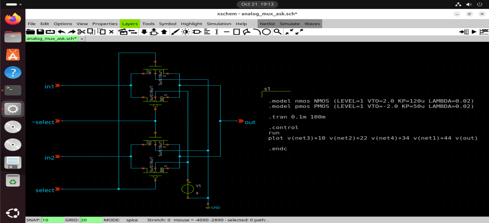
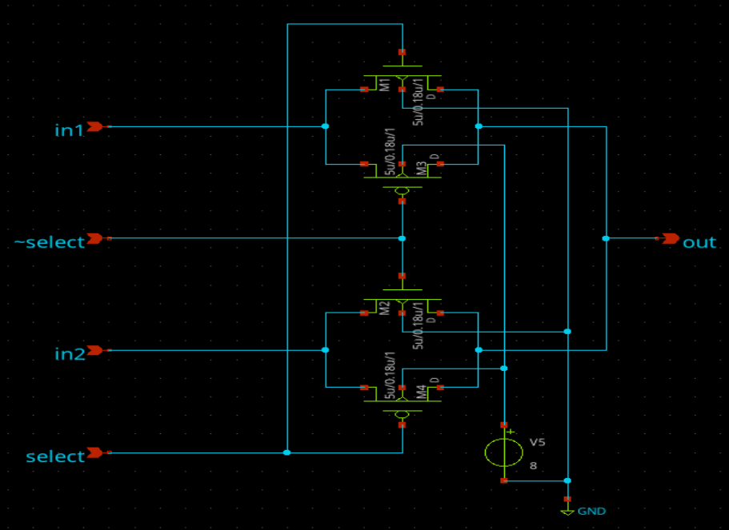  

  
### Magic Implementation of Analog Multiplexer

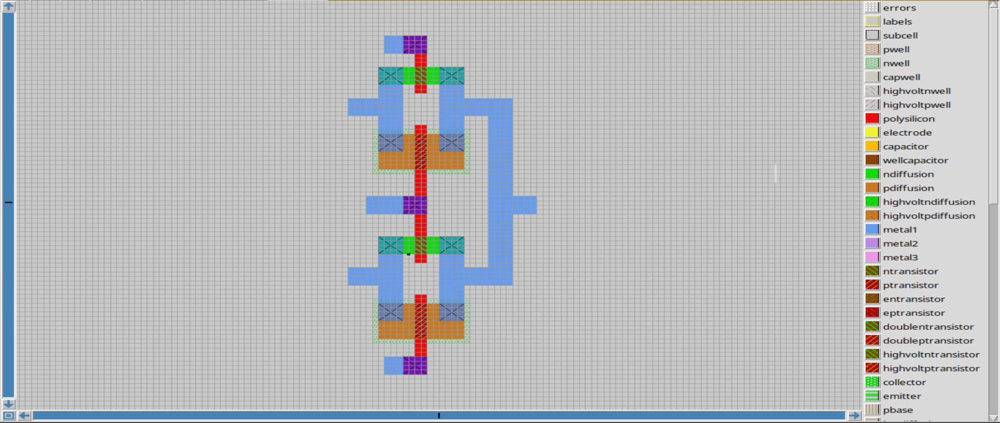 
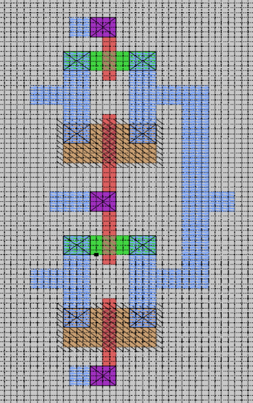 

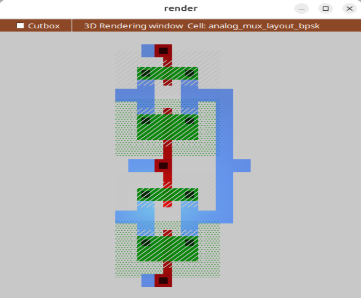

---
# Illustration of Amplitude Shift Keying (ASK) using the analog multiplexer 

Amplitude Shift Keying (ASK) is a basic digital modulation technique where the amplitude of a carrier signal varies according to the input digital data. A logic ‘1’ is represented by a higher amplitude of the carrier, while a logic ‘0’ corresponds to a lower or reference amplitude level.

In this project, the transmission-gate-based analog multiplexer is used to realize ASK modulation:

-  One input of the MUX is fed with a carrier signal of constant frequency.
-  The other input receives a constant reference voltage level.
-  The digital data acts as the control signal for the multiplexer.

When the control signal is logic high (data ‘1’), the transmission gate connecting the carrier input is enabled, allowing the full-amplitude carrier to appear at the output. When the control signal is logic low (data ‘0’), the MUX switches to the reference voltage, resulting in a reduced amplitude output.

Thus, the output alternates between two amplitude levels in accordance with the input data stream, producing an ASK-modulated waveform. This approach demonstrates how a simple analog MUX can perform amplitude-based modulation using transmission-gate switching and can be efficiently verified through SPICE simulations in Xschem and Magic.

### Xshem Circuit Implementation  

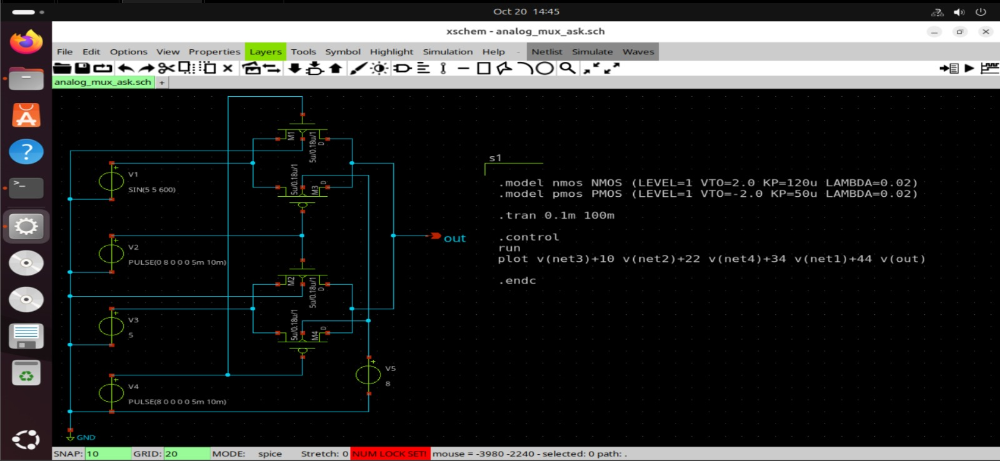 

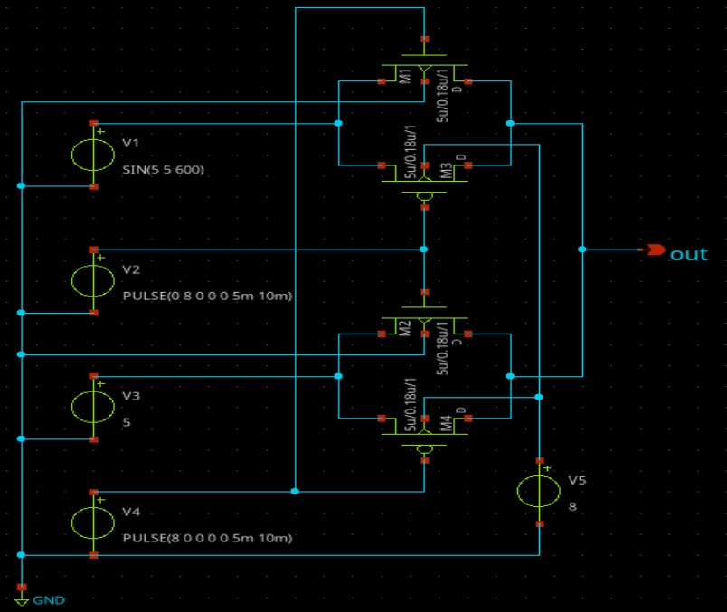 

### Xschem Simulation Results
The following waveforms are obtained by simulating the netlist extracted from Xschem circuit using Ngspice Level-1 SPICE model. 

In the waveforms shown below,
- net1 is Inverted message signal - 100Hz , inversion of message signal.
- net2 is Carrier signal - 600Hz
- net3 is Constant reference voltage - 5V
- net4 is Message signal - 100Hz
- out is ASK output

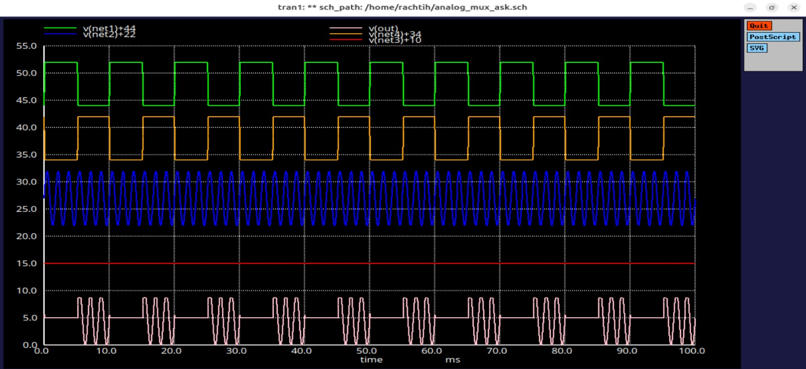 
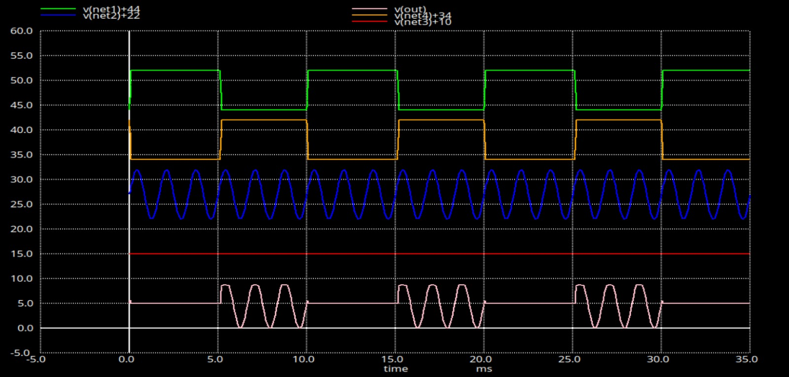 

### Magic Layout Implementation 

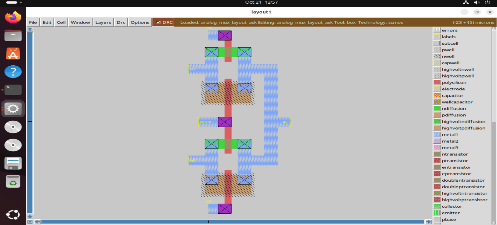  

### Magic Simulation Results  

The following waveforms are obtained by simulating the netlist extracted from Magic Layout using Ngspice Level-1 SPICE model. 

In the waveforms shown below,
- selbar is Inverted message signal - 100Hz , inversion of message signal.
- in1 is Carrier signal - 600Hz
- in2 is Constant reference voltage - 5V
- sel is Message signal - 100Hz
- out is ASK output

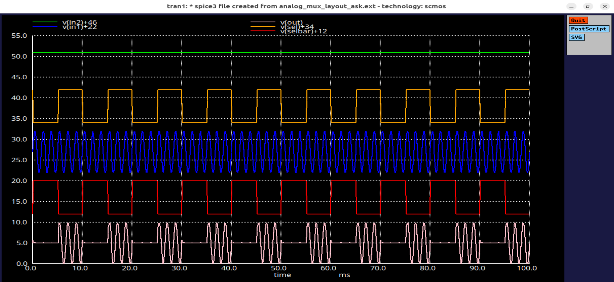
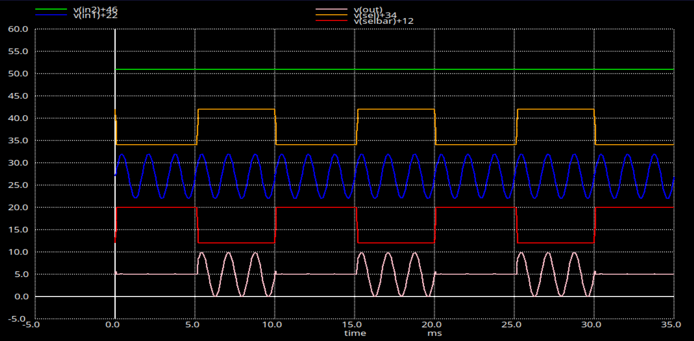

---
# Illustration of Binary Phase Shift Keying (BPSK) using the analog multiplexer

Binary Phase Shift Keying (BPSK) is a digital modulation technique in which the phase of a carrier signal is shifted by 180° depending on the binary data being transmitted. It is one of the most robust and widely used modulation schemes in digital communication due to its high noise immunity and simplicity of implementation.

In this project, the transmission-gate-based analog multiplexer is utilized to demonstrate BPSK modulation:

-  Two input carrier signals of the same frequency but opposite phase (0° and 180°) are generated.

-  These two carrier signals are applied to the two inputs of the analog MUX.

-  The digital data stream serves as the control input to the MUX.

When the control signal is logic high (data ‘1’), the MUX connects the in-phase carrier (0°) to the output. When the control signal is logic low (data ‘0’), the MUX switches to the 180° phase-shifted carrier, effectively inverting the phase of the transmitted signal.

The output waveform thus alternates between two phase states 0° and 180° in synchronization with the input digital data, realizing BPSK modulation. This behavior was verified through SPICE simulations using Xschem and Magic, confirming accurate phase switching and demonstrating the analog MUX’s role in implementing phase-based modulation schemes.

### Xschem Circuit Implementation 

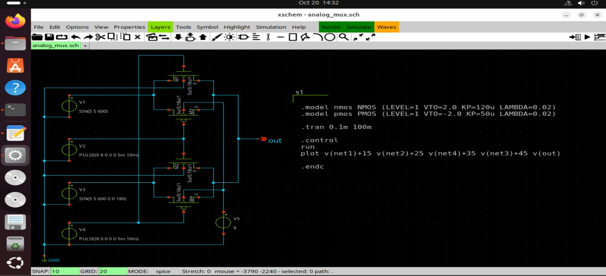

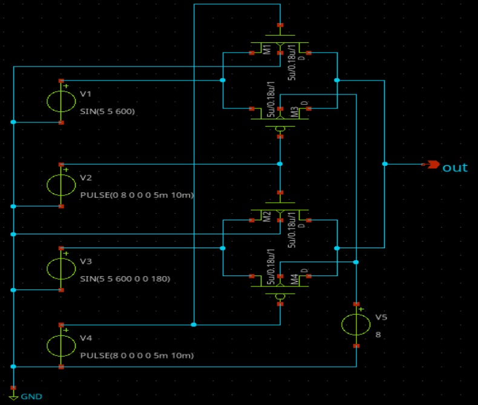 

### Xschem Simulation Results 

The following waveforms are obtained by simulating the netlist extracted from Xschem circuit using Ngspice Level-1 SPICE model. 

In the waveforms shown below,
- net1 is Inverted message signal - 100Hz , inversion of Message signal
- net2 is Carrier signal - 600Hz
- net3 is Inverted carrier signal - 600Hz , 180° phase shift of Carrier signal 
- net4 is Message signal - 100Hz
- out is BPSK output

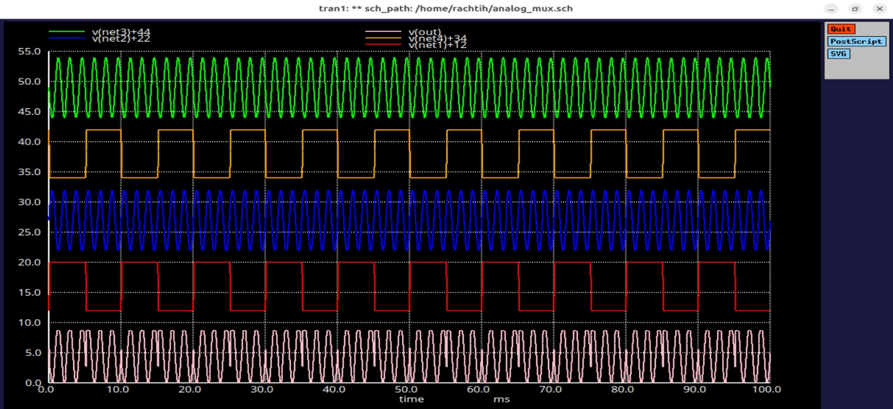 
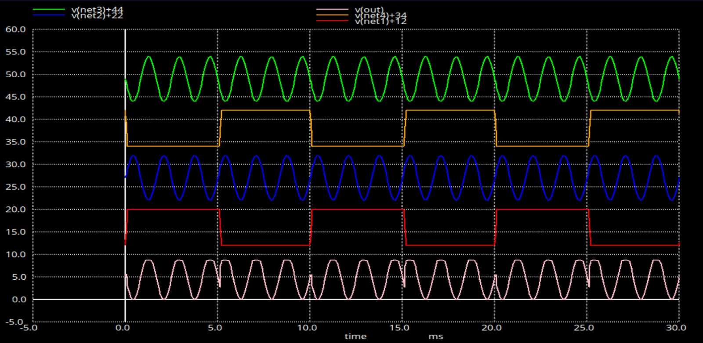 

### Magic Layout Implementation 

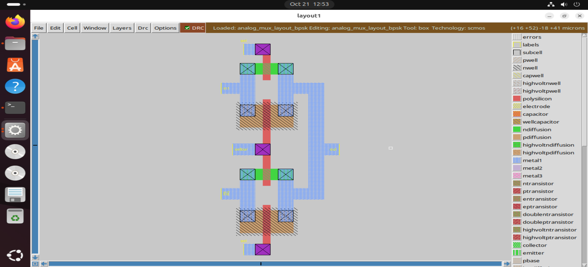  

### Magic Simulation Results  

The following waveforms are obtained by simulating the netlist extracted from Magic Layout using Ngspice Level-1 SPICE model. 

In the waveforms shown below,
- selbar is Inverted message signal - 100Hz , inversion of Message signal
- in1 is Carrier signal - 600Hz
- in2 is Inverted Carrier signal - 600Hz , 180° phase shift of Carrier signal
- sel is Message signal - 100Hz
- out is BPSK output

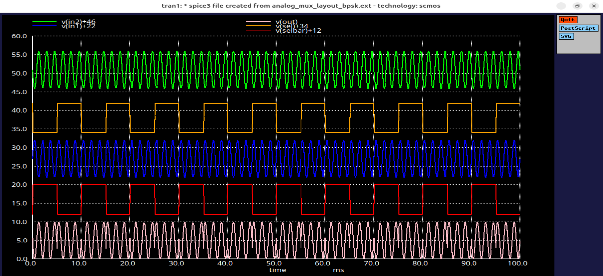
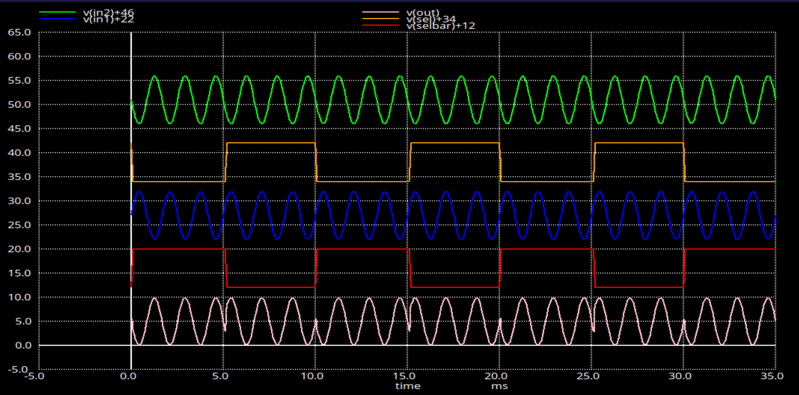

---
# Conclusion  

The design and implementation of a transmission-gate-based analog multiplexer were successfully carried out using Xschem, Magic, and Ngspice on Ubuntu. The waveforms obtained by simulating the netlists from both the Xschem schematic and the Magic layout were found to be identical, confirming the accuracy and consistency of the design flow. The circuit effectively demonstrated Amplitude Shift Keying (ASK) and Binary Phase Shift Keying (BPSK) modulation techniques, validating the versatility of analog multiplexers in communication systems.

Through schematic level and layout level simulations using Level 1 SPICE models, the project verified correct amplitude and phase modulation behavior. The results highlight how a simple analog MUX, when designed using transmission gates, can perform essential signal-processing functions with minimal hardware complexity.

This work serves as a practical example of integrating analog design, SPICE simulation, and VLSI layout implementation using open-source tools, bridging theoretical communication concepts with real-world circuit design.
